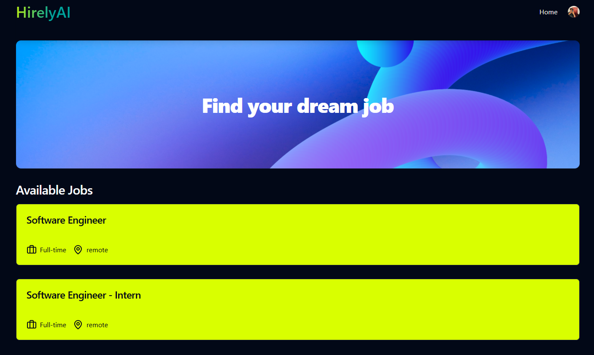
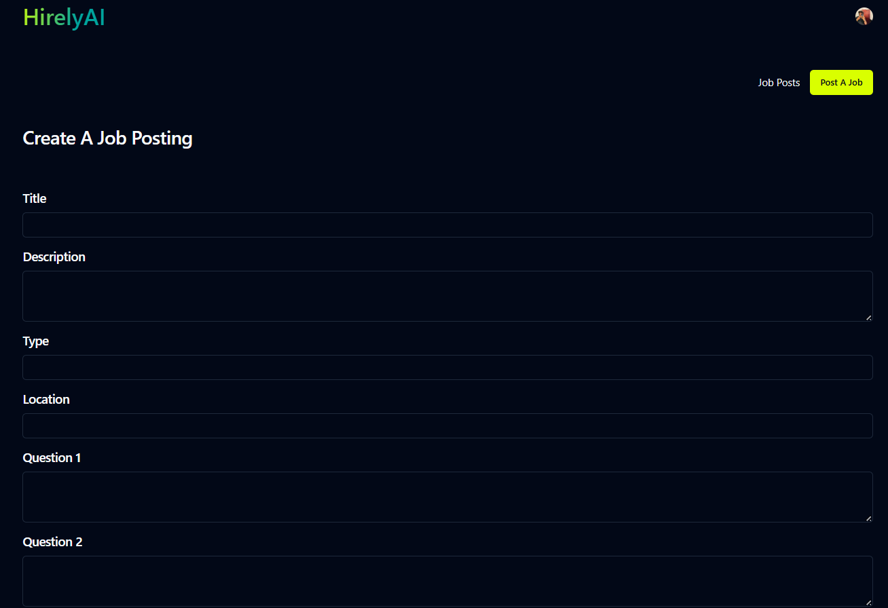
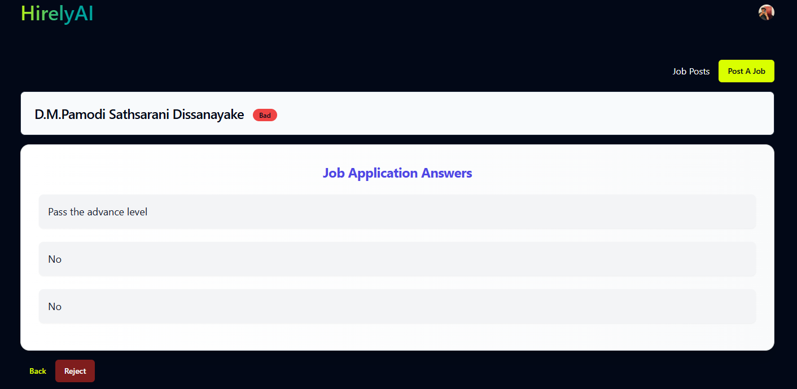

# HirelyAI

HirelyAI is an AI-powered job evaluation platform that helps recruiters and job seekers connect efficiently. Instead of traditional resume matching, HirelyAI assesses applicants based on their responses to a series of questions and provides an AI-driven evaluation of their suitability for a role.

## 🌍 Real-World Problem & Solution

### 🔍 The Problem
Recruiters often struggle to assess candidates beyond their resumes, making it difficult to determine their true potential. Meanwhile, job seekers may not effectively communicate their skills in a traditional resume format, leading to missed opportunities. Manual screening also takes significant time and effort, delaying the hiring process.

### 💡 The Solution
HirelyAI introduces an AI-powered assessment system that evaluates candidates based on their responses to targeted questions. By leveraging OpenAI's GPT-3.5 Turbo, the platform provides an objective assessment, categorizing applicants as **Good, Moderate, or Bad** based on their suitability for a job. This streamlines the hiring process, reduces bias, and ensures better candidate-job alignment.

## 🚀 Features

- 🧠 **AI-Powered Candidate Evaluation** - Uses OpenAI GPT-3.5 Turbo to assess applicants based on their responses to predefined questions.
- 🌐 **User-Friendly Interface** - Built with React, and Tailwind CSS for a smooth user experience.
- 🔐 **Secure Authentication** - Uses Clerk for authentication and user management.
- 📊 **Admin Dashboard** - A powerful dashboard for tracking applications and candidate insights.

## 🛠️ Tech Stack

- **Frontend:** React, Tailwind CSS
- **Backend:** Node.js, Express.js
- **Database:** MongoDB
- **AI Integration:** OpenAI GPT-3.5 Turbo
- **Authentication:** Clerk
- **Deployment:** Railway (Backend), Netlify (Frontend)

## 📸 Screenshots

### Home Page

### Create A Job

### AI Evaluation Result

## 🔗 Live Demo
Check out the live version here: [HirelyAI Live](https://aidf-front-end-dulran.netlify.app/)

## 📧 Contact
For any inquiries, feel free to reach out:
- **Email:** dhemjitha@gmail.com
- **GitHub:** [@dhemjitha](https://github.com/dhemjitha)
- **LinkedIn:** [Dulran-Hemjitha](https://www.linkedin.com/in/dulran-hemjitha/)

[DulranDev](https://dulran.dev/) 

---
Made with ❤️ by **Dulran Hemjitha**
